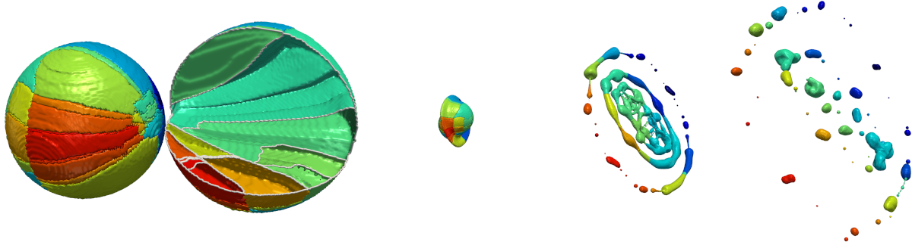
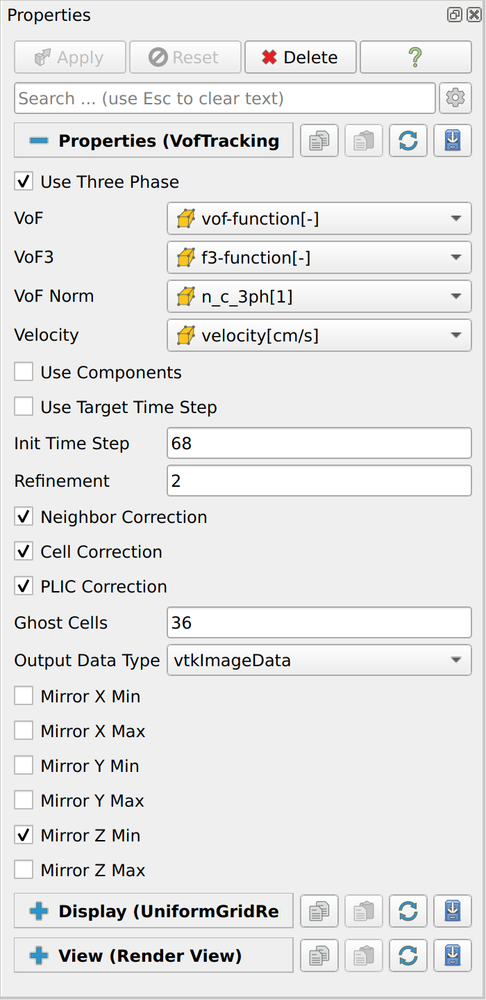
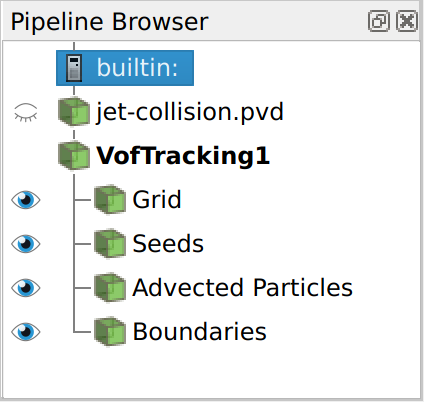

# Visualization of Finite-Time Separation in Multiphase Flow

*Moritz Heinemann, Johanna Potyka, Kathrin Schulte, Filip Sadlo, Thomas Ertl*



This repository contains the ParaView plugin used in our [paper](https://doi.org/10.1109/TVCG.2024.3493607).
We provide [details on the reproducibility](docs/REPRODUCIBILITY.md) and usage examples in the [`docs`](docs) folder of this repository.

## Download

Plugin binaries for ParaView 5.13.2 are provided on the [Release Page](https://github.com/UniStuttgart-VISUS/vof-flow/releases).
They are compatible with the official ParaView 5.13.2 MPI release for Linux or Windows, available from the [ParaView website](https://www.paraview.org/download/):

- [Download ParaView 5.13.2 MPI Linux](https://www.paraview.org/paraview-downloads/download.php?submit=Download&version=v5.13&type=binary&os=Linux&downloadFile=ParaView-5.13.2-MPI-Linux-Python3.10-x86_64.tar.gz)
- [Download ParaView 5.13.2 MPI Windows](https://www.paraview.org/paraview-downloads/download.php?submit=Download&version=v5.13&type=binary&os=Windows&downloadFile=ParaView-5.13.2-MPI-Windows-Python3.10-msvc2017-AMD64.zip)

## Build from source

The plugin can be built from source using the common ParaView plugin interface.
For details, we refer to the [ParaView Plugin Howto](https://www.paraview.org/paraview-docs/v5.13.2/cxx/PluginHowto.html).
A more detailed example of the build steps can be found in our [reproducibility documentation](docs/REPRODUCIBILITY.md).

## Example Data

The jet-collision dataset from our paper can be used as example data:
[https://doi.org/10.18419/darus-4225](https://doi.org/10.18419/darus-4225).

## Plugin Usage

The plugin adds three filters to ParaView.
The main filter is called `VofTracking`, which implements the method described in our paper.
There are two additional filters called `Plic` and `Plic3` to generate the PLIC surfaces of Volume-of-Fluid datasets.
All filters require rectilinear grid data as input.
The properties of the `VofTracking` filters are documented below.

### VofTracking Properties



| Property                 | Description                                                                                           |
|--------------------------|-------------------------------------------------------------------------------------------------------|
| `Use Three Phase`        | Switch between two-phase and three-phase.                                                             |
| `VoF`                    | VoF array.                                                                                            |
| `VoF3`                   | VoF3 array (if three-phase).                                                                          |
| `VoF Norm`               | VoF normals array (if three-phase).                                                                   |
| `Velocity`               | Velocity array.                                                                                       |
| `Use Components`         | Switch to use custom component fields.                                                                |
| `Components VoF`         | Components field for the VoF data.                                                                    |
| `Components VoF3`        | Components field for the VoF3 data (if three-phase).                                                  |
| `Use Target Time Step`   | Switch to use a fixed target time step. If false, the current ParaView time is used.                  |
| `Init Time Step`         | Initial time step.                                                                                    |
| `Target Time Step`       | Target time step (if `Use Target Time Step` is true, otherwise current ParaView time is used).        |
| `Refinement`             | Number of seeded particles per cell is (r+1)^3.                                                       |
| `Neighbor Correction`    | Enable Neighbor Correction step.                                                                      |
| `Cell Correction`        | Enable Cell Correction step.                                                                          |
| `PLIC Correction`        | Enable PLIC Correction step.                                                                          |
| `Integration Method`*    | Select the particle advection integration method: `RK4` or `Euler`.                                   |
| `Integration Sub-Steps`* | Select the number of sub-steps used for the integration.                                              |
| `Epsilon`*               | Epsilon for the PLIC surface generation.                                                              |
| `Num Iterations`*        | Maximum number of iterations used for the PLIC surface generation.                                    |
| `Ghost Cells`            | Number of ghost cells shared between MPI processes.                                                   |
| `Cut Labels`*            | Use label cut function (experimental).                                                                |
| `Label Cut Type`*        | vtkImplicitFunction for cutting label space (experimental).                                           |
| `Boundary Method`*       | Method used to generate the separation boundaries `DiscreteMarchingCubes` or `DiscreteFlyingEdges3D`. |
| `Output Data Type`       | Type of the grid output data: `vtkRectilinearGrid` or `vtkImageData`.                                 |
| `Output State`*          | Store state of plugin properties as json in the output data.                                          |
| `Output Time Measure`*   | Store benchmarking data in the output data.                                                           |
| `Mirror X Min`           | Mirror boundary condition at X min boundary.                                                          |
| `Mirror X Max`           | Mirror boundary condition at X max boundary.                                                          |
| `Mirror Y Min`           | Mirror boundary condition at Y min boundary.                                                          |
| `Mirror Y Max`           | Mirror boundary condition at Y max boundary.                                                          |
| `Mirror Z Min`           | Mirror boundary condition at Z min boundary.                                                          |
| `Mirror Z Max`           | Mirror boundary condition at Z max boundary.                                                          |

Properties marked with `*` are advanced properties.
Use the ParaView `Toggle advanced properties` button to show them.

### VofTracking Output



The VofTracking filter has four outputs.

| Output             | Description                                                                                    |
|--------------------|------------------------------------------------------------------------------------------------|
| Grid               | Output grid with the extracted labels and the grid-based uncertainty values.                   |
| Seeds              | Seeded particles, including label and particle-based uncertainty values.                       |
| Advected Particles | End position of the advected particles, including label and particle-based uncertainty values. |
| Boundaries         | Extracted separation boundaries.                                                               |

## Citing

If you use our work in a scientific context, please cite our work:

M. Heinemann, J. Potyka, K. Schulte, F. Sadlo, T. Ertl: "**Visualization of Finite-Time Separation in Multiphase Flow**" in IEEE Transactions on Visualization and Computer Graphics, doi: 10.1109/TVCG.2024.3493607.

```bibtex
@Article{Heinemann2024VofFlow,
  author  = {Heinemann, Moritz and Potyka, Johanna and Schulte, Kathrin and Sadlo, Filip and Ertl, Thomas},
  journal = {IEEE Transactions on Visualization and Computer Graphics},
  title   = {Visualization of Finite-Time Separation in Multiphase Flow},
  year    = {2024},
  pages   = {1-14},
  doi     = {10.1109/TVCG.2024.3493607},
}
```

## License

> Copyright (c) 2024 - 2025, Visualization Research Center (VISUS), University of Stuttgart

Our code in this repository is licensed under the [BSD 3-Clause License](LICENSE).

Additionally, the following dependencies with their corresponding licenses are used and/or downloaded automatically during the build step or in some of our scripts:

- [ParaView](https://gitlab.kitware.com/paraview/paraview)
- [CGAL](https://github.com/cgal/cgal)
- [vcpkg](https://github.com/microsoft/vcpkg)
- [ParaViewEasyPluginBuilder](https://gitlab.kitware.com/paraview/paraview-easy-plugin-builder)
